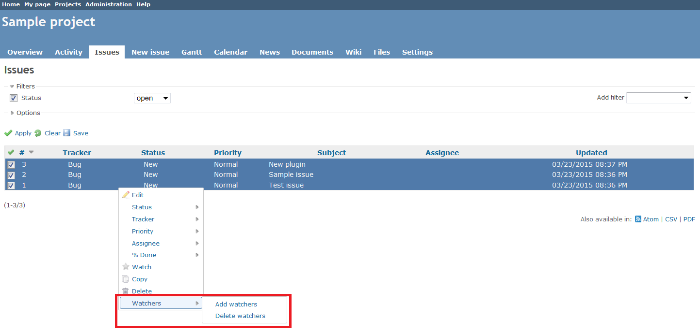
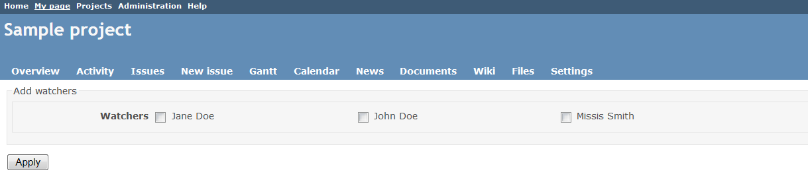
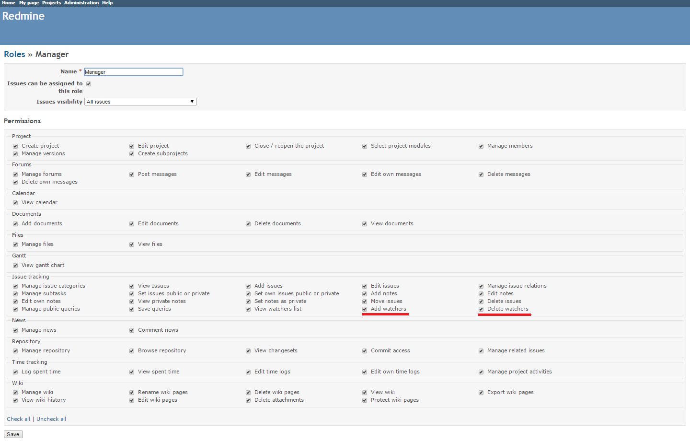

Redmine Watchers Context Menu Plugin 

This plugin adds watchers-related items to the issue context menu in Redmine.

The initial author of the plugin is [Vitaly Klimov](mailto:vitaly.klimov@snowbirdgames.com).

## Compatibility

This plugin version is compatible only with Redmine 1.3.0 and later.

## Installation

*These installation instructions are based on Redmine 2.6.0. For instructions for previous versions, see [Redmine wiki](http://www.redmine.org/projects/redmine/wiki/Plugins).*

1. To install the plugin
    * Download the .ZIP archive, extract files and copy the plugin directory into #{REDMINE_ROOT}/plugins.
    
    Or

    * Change you current directory to your Redmine root directory:  

            cd {REDMINE_ROOT}
            
      Copy the plugin from GitHub using the following commands:
      
            git clone https://github.com/Undev/redmine_context_menu_watchers.git plugins/redmine_context_menu_watchers
            
2. Restart Redmine.

Now you should be able to see the plugin in **Administration > Plugins**.

## Usage

The plugin extends the issue context menu with several watchers-related items that allow you to perform batch operations on the selected issues:  

* **Watch** - adds the current user as a watcher of the selected issues
* **Unwatch** - removes the current user from the list of watchers of the selected issues
* **Add watchers* - allows you to select project members to be added as watchers of the selected issues
* **Delete watchers** - allows you to select project members to be removed from the list of watchers of the selected issues.

All the issues selected for the **Add watchers** / **Delete watchers** batch operations must belong to the same project. The **Add watchers** / **Delete watchers** item opens a new Redmine page where all project members are listed:  

To be able to add or delete watchers, you should have the appropriate watchers-related permissions enabled in the **Issue tracking* section:  

## License

Copyright (c) 2015 Undev

Licensed under the Apache License, Version 2.0 (the "License");
you may not use this file except in compliance with the License.
You may obtain a copy of the License at

http://www.apache.org/licenses/LICENSE-2.0

Unless required by applicable law or agreed to in writing, software
distributed under the License is distributed on an "AS IS" BASIS,
WITHOUT WARRANTIES OR CONDITIONS OF ANY KIND, either express or implied.
See the License for the specific language governing permissions and
limitations under the License.